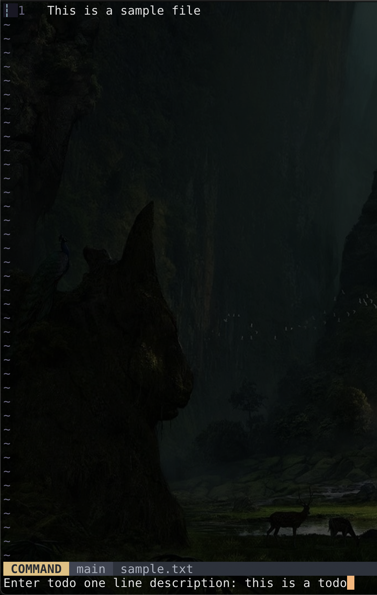
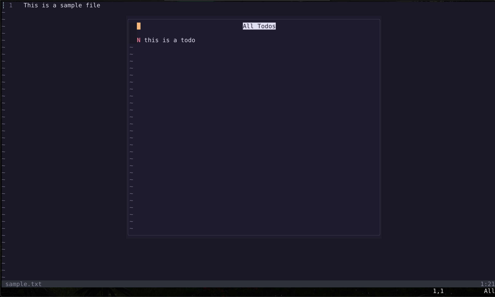
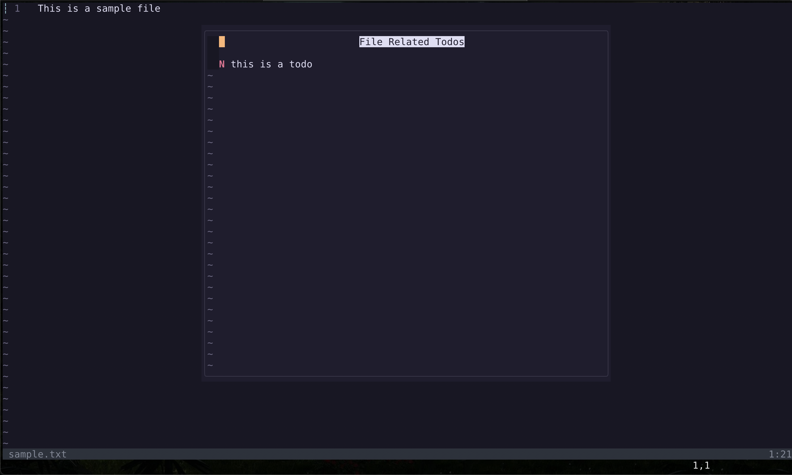
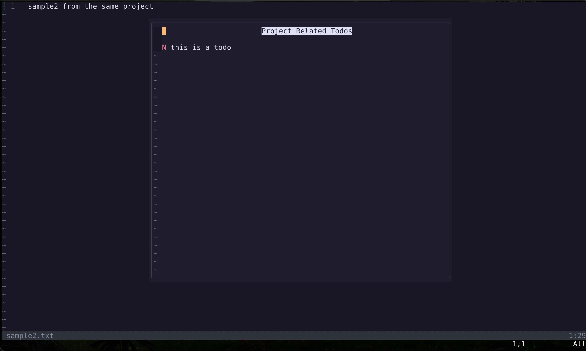
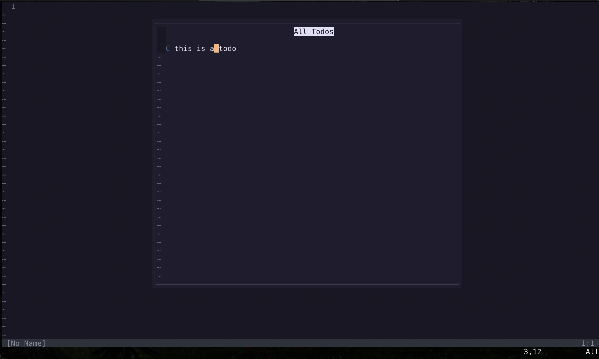

# Todolist.nvim

This is a neovim plugin, to manage your todos.

When you are working on a project and want to note something and come back to it later, you can add a todolist item. This will be stored and available for checking off/deletion later.

## Features:

1. add todo
2. get all todos that were added from the current file / current project / anywhere
3. marka todo as completed
4. delete a todo

### Add todo (\<Leader\>at)


### Display all todos (\<Leader\>t)


### Display current file related todos (\<Leader\>ft)


### Display current project related todos (\<Leader\>pt)


### Toggle completed status(c when inside todo window)


## Installation:

```lua
  {
    'swims-hjkl/todolist.nvim',
    dependencies = {
      'nvim-lua/plenary.nvim',
    }
  },


  require("todolist")
```

## Keymaps

if you want to change the configuration for keymaps, send these keymaps to the setup 

```lua
  require("todolist").setup({
    add_todo = "<Leader>at",
    show_todo_all = "<Leader>t",
    show_todo_project = "<Leader>pt",
    show_todo_file = "<Leader>ft",
  })
```
